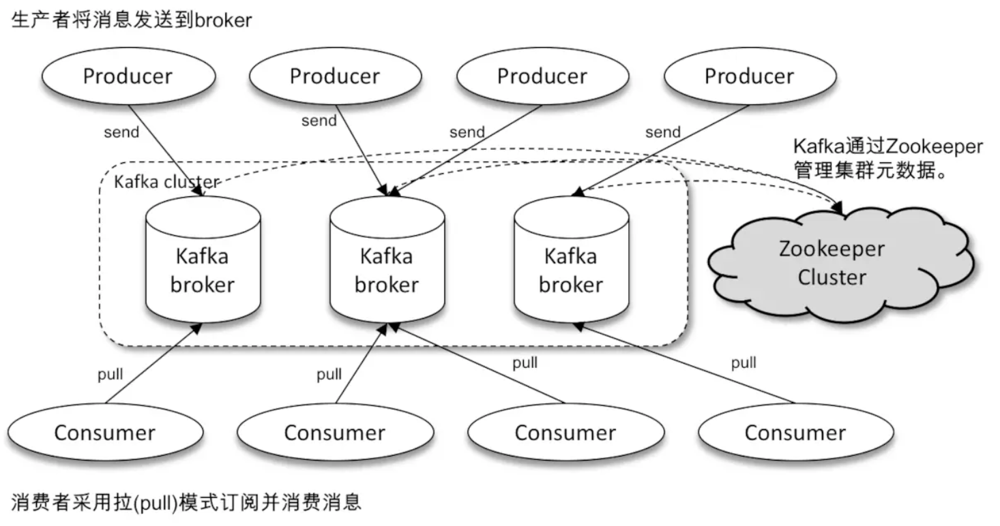
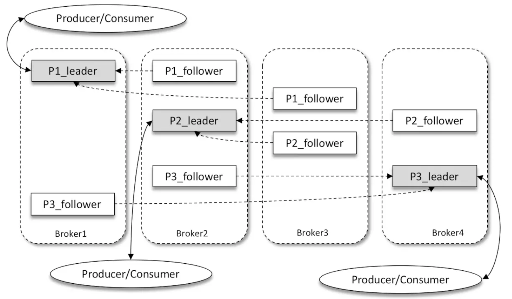
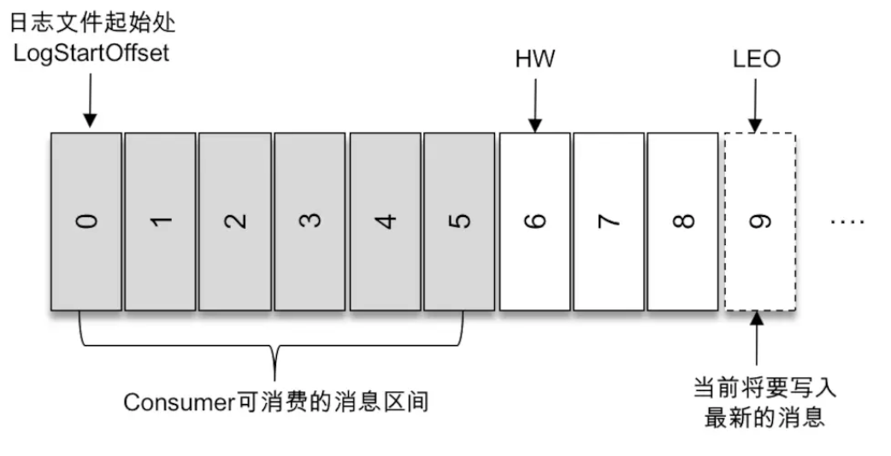

`Kafka`采用`Scala`语言开发的一个多分区、多副本且基于`ZooKeeper`协调的分布式消息系统。

## 体系结构

Kafka 体系架构：

- 若干个生产者`Producer`。

  > `Producer`作用是将消息发送到`Broker`。

- 若干个`Broker`。

  > `Broker`负责将收到的消息存储在磁盘上。

- 若干个消费者`Consumer`。

  > `Consumer`负责从`Broker`订阅并消费消息。

- 一个`Zookeeper`集群。

  > `ZooKeeper`是`Kafka`用来负责**集群元数据的管理**、控制器的**选举**等操作的。

注意：`Kafka`和其他的消息队列有所不同，**消费者采用拉模式订阅并消费消息。**

## 术语

### 生产者-Producer

生产者，即发送消息的一方。

生产者负责创建消息，并投递到`Kafka`中。

### 消费者-Consumer

消费者，即接受消息的一方。

消费者连接到Kafka上，并接受消息。

### 代理者-Broker

**`Broker`可以简单地看作一个独立的`Kafka`服务节点或`Kafka`服务实例。**

一个或多个`Broker`组成一个`Kafka`集群。

### 主题-Topic & 分区-Partition

生产者`Producer`发送消息其实是**发送到指定的主题**。消费者负责**订阅主题**并消费。

- 主题是逻辑上的概念，**主题可以细分为多个分区。**

- **一个分区只属于单个主题。**

- 同一个主题下的不同分区包含的消息是不同的。

- 分区在存储层面可以**看作一个可追加的日志文件。**

- 消息被追加到分区日志文件时都会分配一个特定的偏移量`offset`。

  `offset`是分区中的唯一标识。通过`offset`来**<u>保证消息在分区内的顺序性。</u>**

  `offset`不跨越分区。所以`Kafka`只能**<u>保证分区有序，不能保证主题有序。</u>**即同一个主题不同分区间不能保证顺序性。

- 分区可以分布在不同的服务器（`broker`）上。

  以此提供比单个`broker`更强大的性能。

### 副本-Replica

多副本机制是针对分区的。多副本机制可以提升容灾能力。

- 同一个分区的不同副本中**保存的是相同的消息**。

  > 在同一时刻，并非完全一样，存在一定的滞后。

- 副本间是"**一主多从**"的关系。

  leader 副本负责处理读写请求。follower 副本只负责与 leader 副本的消息同步。

  副本处于不同的`broker`中。

  当 leader 副本出现故障时，从 follower 副本中重新选举新的 leader 副本对外提供服务。

> 如上图所示，Kafka 集群中有4个 broker，某个主题中有3个分区，且副本因子（即副本个数）也为3，如此每个分区便有1个 leader 副本和2个 follower 副本。生产者和消费者只与 leader 副本进行交互，而 follower 副本只负责消息的同步，很多时候 follower 副本中的消息相对 leader 副本而言会有一定的滞后。

#### AR、ISR、OSR

- AR：分区中所有副本统称为 AR ，即`Assigned Replicas`：**已分配的副本。**

- ISR：所有与 leader 副本保持一定程度同步的副本（**包括leader副本**） 组成 ISR，即`In-Sync Replicas`：**同步副本。**

  ISR 集合是 AR 集合中的一个子集。由于 follower 副本是从 leader 副本中拉取消息进行同步，所以相对于 leader 副本，follower 副本会有一定程度的滞后。

  > 这个`一定程度的滞后`的范围可以通过参数配置。

- OSR：与 leader 副本同步滞后过多的副本（**不包括 leader 副本**）组成 OSR，即`Out-of-Sync Replicas`：**不同步的副本。**

总结：

- AR = ISR + OSR

- 正常情况下，所有的 follower 副本都与 leader 副本保持一定程度的同步。

  即 AR = ISR，OSR 为空。

- leader 副本负责维护 follower 副本的滞后状态。

  若 ISR 中的 follower 副本滞后太多，则会从 ISR 转移到 OSR。

  若 OSR 中的 follower 副本追上了 leader 副本，则会从 OSR 转移到 ISR。

- 默认情况下，当 leader 副本发送故障时，只有 ISR 中的副本才有资格被选举为新的 leader。

  > 这个只是默认情况，也可以通过修改配置来改变。

#### HW、LEO

- HW：`High Watermark`：高水位。

  它标识了一个特定的消息偏移量`offset`，消费者只能拉取到这个`offset`之前的消息。

- LEO：`Log End Offset`：记录结束偏移量。

  它标识当前日志文件中下一条待写入消息的`offset`。

> 如图，HW 为6，则消费者只能拉取到`offset`从0～5的消息。`offset`为6的消息对消费者不可见。

#### ISR 和 HW、LEO的关系

<u>**分区 ISR 集合中的每个副本都会维护自身的 LEO，而 ISR 集合中最小的 LEO 即为分区的 HW，对消费者而言只能消费 HW 之前的消息。**</u>

`Kafka`的复制机制既不是完全的同步复制，则不是单纯的异步复制。

- 如果是完全的同步复制，要等待所有的 follower 副本都复制完成，消息才会被确认为已成功提交。影响性能。
- 如果是异步复制。如果 follower 副本还没有复制完，leader 副本突然宕机，造成数据丢失。
- ISR 方式有效的权衡了数据可靠性和性能之间的关系。

## 参考资料

- 《深入理解Kafka 核心设计与实践原理》