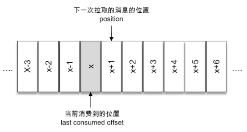
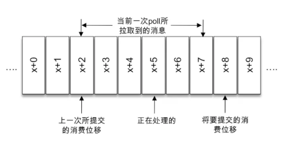

## offset

### 对分区而言

【概念】：它的每条消息都有唯一的 offset，用来表示<u>消息在分区中对应的位置</u>。

【约定】：对于消息在分区中的位置，我们将offset称为"<u>偏移量</u>"。

### 对消费者而言

【概念】：表示<u>消费到分区中某个消息所在的位置</u>。

【约定】：对于消费者消费到的位置，我们将offset称为"<u>位移</u>"。

> 对于一条消息而言，它的偏移量和消费者消费它时的消费位移是相等的。

## 消费位移保存在哪

【描述】：每次调用`poll()`时，返回的事还没有被消费过的消息集，要做到这一点，就需要记录上次消费时的消费位移。并且这个消费位移要做持久化保存。

- 在旧消费者客户端中，消费位移是存储在 zookeeper 中的。
- 在新消费者客户端中，消费位移存储在kafka内部的主题`__consumer_offsets`中。

> 这里把消费位移存储起来（持久化）的动作称为"提交"。消费者在消费完消息之后需要执行消费位移的提交。

## lastConsumedOffset、committed offset和position关系

【`lastConsumedOffset`】：当前消费到的位置。

【`position`】：下一次拉取的消息的位置。

【`committed offset`】：已经提交过的消费位移。

> 具体如下：



如图，x表示某一次拉取操作中此分区消息的最大偏移量，假设当前消费者已经消费了x位置的消息，那么我们就可以说消费者的消费位移为x，用`lastConsumedOffset`来表示。

注意：当前消费者需要提交的消费位移并不是x，而是x+1，对应图中的`position`，表示下一条需要拉取的消息位置。

在消费者中还有一个`committed offset`，表示已经提交过的消费位移。

`KafkaConsumer`提供了`position(TopicPartition)`和`committed(TopicPartition)`两个方法来分别获取`position`和`committed offset`的值。

```java
long position(TopicPartition partition);
OffsetAndMetadata committed(TopicPartition partition);
```

【结论】：详见案例：`OffsetConsumer`

```
position = committed offset = lastConsumedOffset + 1
```

> 当然`position`和`committed offset`并不会一直相同，


## 重复消费和消息丢失



【前提】：当前一次的`poll()`操作拉取的消息集为[x+2, x+7]，x+2代表上一次提交的消费位移，说明已经完成x+1之前（包括x+1）的所有消息的消费，x+5表示当前正在处理的位置。

【消息丢失现象】：如果拉取之后就进行位移提交，即提交了x+8，那么当消费x+5时遇到了异常，在故障恢复之后，我们重新拉取的消息是x+8开始的。也就是说，x+5至x+7之间的消息并没有被消费，发生了消息丢失。

【重复消费现象】：如果位移提交是在消费完所有拉取的消息之后才执行的，那么当消费x+5的时候遇到了异常，在故障恢复后，我们重新拉取的消息是从x+2开始的。也就是说，x+2至x+4之间的消息又重复消费了一遍，发生了重复消费。

## 消费位移提交方式

### 自动提交

【描述】：

- **<u>默认</u>**的提交方式。

【配置】：

- 由消费者客户端参数`enable.auto.commit`配置，默认为true，即自动提交。
- 自动提交并不是每消费一条消息就提交一次，而是**<u>定期提交</u>**，这个定期的周期由消费者客户端参数`auto.commit.interval.ms`配置，默认5秒，此参数生效的前提是`enable.auto.commit`为true。

【特点】：

- 默认方式下，消费者每隔5秒会<u>将拉取到的每个分区中最大的消息位移进行提交。</u>

- 自动提交的动作在`poll()`方法的逻辑里完成的，在每次真正向服务器发起拉取请求之前会检查是否可以进行位移提交，如果可以，那么就会提交上一次轮询的位移。

  > 上面说默认每隔5秒自动提交，这里说拉取前也可能提交，这里应该是两种情况，再次拉取请求的时间可能在拉取间隔时间之内，所以需要做检查。

- <u>自动提交是**延迟提交**。</u>

#### 自动提交的重复消费和消息丢失

【重复消费】：假设刚刚提交完一次消息位移，然后拉取一批新的消息进行消费，在下一次自动提交消费位移之前，消费者崩溃了，那么又得从上一次位移提交的地方重新开始消费，这便发生了重复消费。

> 可以通过减小位移提交的时间间隔`auto.commit.interval.ms`来减小重复消费消息的窗口大小，但这样并不能避免重复消费，也会使提交更加频繁。

【消息丢失】：线程A拉取消息存入本地缓存中，另一个线程B从缓存中读取消息并消费，当线程B发生了异常，会发生消息丢失。

> 详见书P65~66.


### 手动位移提交

【配置】：

- 手动提交的前提：消费者客户端参数`enable.auto.commit`配置为false。

#### 同步提交

> 代码：`CommitSyncConsumer`

##### 按照拉取批次提交

【方法】：`KafkaConsumer`的方法：

```java
void commitSync();
```

【描述】：

- `commitSync()`方法会根据`poll()`方法拉取的最新位移来进行提交，提交的值是`position`的位置。
- 只要不发生不可恢复的错误，它就会**阻塞消费者线程**，直至位移提交完成。
- 对于不可恢复的错误：`CommitFailedException`、`WakeupException`、`InterruptException`、`AuthenticationException`、`AuthorizationException` 等，我们可以将其捕获并做针对性的处理。
- **无参的`commitSync()`方法只能提交当前批次对应的`position`值。**

【案例】：

```java
while (true) {
  ConsumerRecords<String, String> records = consumer.poll(Duration.ofMillis(1000));
  for (ConsumerRecord<String, String> record : records) {
    System.out.println(record.value());
  }

  // 同步位移提交
  consumer.commitSync();
}
```

> 该方式有重复消费的问题。

##### 指定位移提交

【方法】：

```java
void commitSync(Map<TopicPartition, OffsetAndMetadata> offsets);
```

【描述】：

- `commitSync(offsets)`可以提交指定分区的中间值。

【示例】：业务每消费一条消息就提交一次位移。

```java
while (true) {
  ConsumerRecords<String, String> records = consumer.poll(Duration.ofMillis(1000));
  for (ConsumerRecord<String, String> record : records) {
    System.out.println(record.value());

    long offset = record.offset();
    TopicPartition partition = new TopicPartition(record.topic(), record.partition());
    // 同步位移提交 : 指定位移提交
    consumer.commitSync(Collections.singletonMap(partition, new OffsetAndMetadata(offset + 1)));
  }
}
```

> 该方式性能很低。

##### 按照分区粒度提交

【方法】：

```java
void commitSync(Map<TopicPartition, OffsetAndMetadata> offsets);
```

> 结合`ConsumerRecords`的`partitions()`和`records(TopicPartition)`两个方法一起使用，做到按照分区的粒度提交。

【示例】：

```java
while (true) {
  ConsumerRecords<String, String> records = consumer.poll(Duration.ofMillis(1000));
  for (TopicPartition partition : records.partitions()) {
    // 按照分区维度进行消费
    List<ConsumerRecord<String, String>> partitionRecords = records.records(partition);
    for (ConsumerRecord<String, String> record : partitionRecords) {
      System.out.println(record.value());
    }
    // 按照分区维度进行提交位移
    long lastConsumedOffset = partitionRecords.get(partitionRecords.size() - 1).offset();// 获取这个分区的最后一条记录的offset, 就是当前消费到的位置
    consumer.commitSync(Collections.singletonMap(partition, new OffsetAndMetadata(lastConsumedOffset + 1))); // 指定需要提交的位移
  }
}
```


#### 异步提交

【特点】：

- 异步提交方式在执行的时候<u>消费者线程不会被阻塞</u>，可能在提交消费位移的结果还未返回之前就开始了新一次的拉取操作。

- 性能得到了增强。

【方法】：`KafkaConsumer`的方法：

```java
// 对应 commitSync()
void commitAsync();
void commitAsync(OffsetCommitCallback callback);
// 对应 commitSync(Map<TopicPartition, OffsetAndMetadata> offsets)
void commitAsync(Map<TopicPartition, OffsetAndMetadata> offsets, OffsetCommitCallback callback);
```

第二个和第三个方法提供了一个异步提交的回调方法，当位移提交完成后会回调`OffsetCommitCallback`中的`onComplete()`方法。

【示例】：`CommitAsyncConsumer`

```java
while (true) {
  ConsumerRecords<String, String> records = consumer.poll(Duration.ofMillis(1000));
  for (ConsumerRecord<String, String> record : records) {
    System.out.println(record.value());
  }

  // 异步位移提交
  consumer.commitAsync(new OffsetCommitCallback() {
    @Override
    public void onComplete(Map<TopicPartition, OffsetAndMetadata> offsets, Exception exception) {
      if (exception == null) {
        System.out.println(offsets);
      } else {
        log.error("fail to commit offset {}, exception is {}", offsets, exception);
      }
    }
  });
}
```

##### 异步提交失败的问题

详见书P70.

