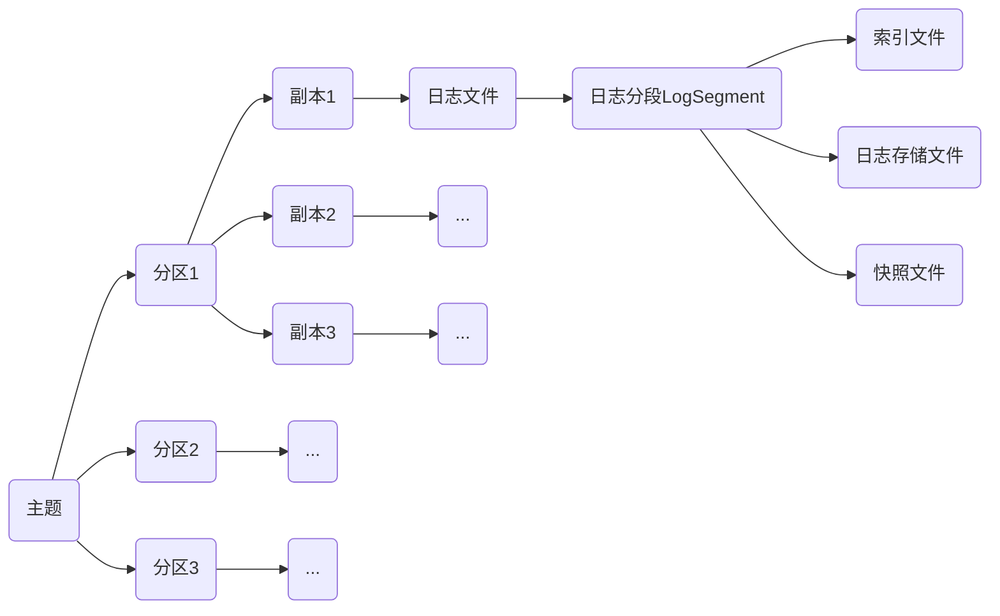

1. 主题作为消息的归类，分区可以看作对消息的二次归类。
2. 从Kafka底层实现来说，主题和分区都是<u>逻辑上</u>的概念。

```mermaid
graph LR
A(主题) --> B1(分区1)
A(主题) --> B2(分区2)
A(主题) --> Bn(分区3)
B1(分区1) --> C1(副本1)
B1(分区1) --> C2(副本2)
B1(分区1) --> C3(副本3)
B2(分区2) --> C4(...)
Bn(分区3) --> C5(...)
C1(副本1) --> D1(日志文件)
C2(副本2) --> D2(...)
C3(副本3) --> D3(...)
D1(日志文件) --> E(日志分段LogSegment)
E(日志分段LogSegment) --> E1(索引文件)
E(日志分段LogSegment) --> E2(日志存储文件)
E(日志分段LogSegment) --> E3(快照文件)
```

