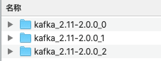

> 本节书中说的 `broker`端配置参数，均是服务器端参数，即配置文件`server.properties`。
>
> 详见[服务端参数配置](服务端参数配置.md)。

## 主题管理的方式

【方式一：`Kafka-topics.sh`】:

- 脚本位于`$KAFKA_HOME/bin/`目录下。
- 本质：调用`Kafka.admin.TopicCommand`类来执行主题管理的工作。

【方式二：`KafkaAdminClient`】：

- 详见书6.1节。

【方式三：直接操纵日志文件和 zookeeper节点来实现】


## 前提准备

在本地搭建一个kafka集群。

1. 路径：`/Users/enhao/develop/kafka-cluster`。

   

2. 集群中有三个broker，如上图，命名规则：`kafka_2.11-2.0.0_${broker.id}`。

3. 三个broker的核心配置如下：

```properties
# broker 0
broker.id=0
listeners=PLAINTEXT://localhost:19092
log.dirs=/Users/enhao/develop/kafka-cluster/kafka_2.11-2.0.0_0/log
zookeeper.connect=localhost:2181/kafka_cluster

# broker 1
broker.id=1
listeners=PLAINTEXT://localhost:19093
log.dirs=/Users/enhao/develop/kafka-cluster/kafka_2.11-2.0.0_1/log
zookeeper.connect=localhost:2181/kafka_cluster

# broker 2
broker.id=2
listeners=PLAINTEXT://localhost:19094
log.dirs=/Users/enhao/develop/kafka-cluster/kafka_2.11-2.0.0_2/log
zookeeper.connect=localhost:2181/kafka_cluster
```

4. 分别启动zookeeper和三个kafka。

   ```shell
   # 启动zookeeper
   bin/zkServer.sh start
   
   #启动kafka，三个broker命名一样，在三个文件夹中启动
   bin/kafka-server-start.sh -daemon config/server.properties
   ```

   

## 创建主题

### 自动创建主题

【配置】：`auto.create.topics.enable = true`，详见[服务端参数配置](服务端参数配置.md)。

【场景】：

- <u>当生产者下向一个尚未创建的主题发送消息时</u>，会自动创建一个分区数为[`num.partitions`](服务端参数配置.md)、副本因子为[`default.replication.factor`](服务端参数配置.md)的主题。
- <u>当一个消费者开始从未知主题中读取消息时</u>，或者<u>当任意一个客户端向未知主题发送元数据请求时</u>，都会按照配置参数[`num.partitions`](服务端参数配置.md)、[`default.replication.factor`](服务端参数配置.md)来创建一个相应的主题。

【注意】：不推荐。

### 手动创建主题

【创建主题的指令格式归纳如下】：

```shell
kafka-topics.sh --zookeeper <String: hosts> --create --topic [String: topic] --partitions <Integer: of partitions> --replication-factor <Integer: replication factor>
```

> 该方式使用既定的内部逻辑来进行分区副本的分配的。
>
> 若想手动指定分区副本的分配方案，详见[手动指定分区副本的分配方案](#手动指定分区副本的分配方案)。

【创建主题】：在任意一个broker中。

```sh
# 创建一个topic为 topic-create的主题，分区数：4，副本因子：2
bin/kafka-topics.sh --zookeeper localhost:2181/kafka_cluster --create --topic topic-create --partitions 4 --replication-factor 2

Created topic "topic-create".
```

> `create`：指令类型、`zookeeper`：zookeeper连接地址、`topic`：主题名称、`partitions`：分区数、`replication-factor`：副本因子。

#### 使用config参数创建主题

【创建主题时使用`config`参数】：

```shell
bin/kafka-topics.sh --zookeeper localhost:2181/kafka_cluster --create --topic topic-config --partitions 1 --replication-factor 1 --config cleanup.policy=compact --config max.message.bytes=10000

Created topic "topic-config".
```

【使用describe命令查看主题详情】：

```shell
bin/kafka-topics.sh --zookeeper localhost:2181/kafka_cluster --describe --topic topic-config

Topic:topic-config	PartitionCount:1	ReplicationFactor:1	Configs:cleanup.policy=compact,max.message.bytes=10000
	Topic: topic-config	Partition: 0	Leader: 1	Replicas: 1	Isr: 1
```

【使用zookeeper客户端查看主题config信息】：

```shell
[zk: localhost:2181(CONNECTED) 7] get /kafka_cluster/config/topics/topic-config

{"version":1,"config":{"max.message.bytes":"10000","cleanup.policy":"compact"}}
```

### 使用TopicCommand创建主题

`Kafka-topics.sh`的本质是调用了`kafka.admin.TopicCommand`类，通过向`TopicCommand`类中 传入一些关键参数来实现主题的管理。

【直接调用`TopicCommand`类中的main方法直接管理主题】：

前提：增加依赖：

```xml
<properties>
  <kafka.version>2.0.0</kafka.version>
  <scala.version>2.11</scala.version>
</properties>
<dependencies>
  <!-- 使用TopicCommand类 -->
  <dependency>
    <groupId>org.apache.kafka</groupId>
    <artifactId>kafka_${scala.version}</artifactId>
    <version>${kafka.version}</version>
  </dependency>
</dependencies>
```

代码：`CreateTopicByTopicCommand`

```java
public class CreateTopicByTopicCommand {

    public static void main(String[] args) {
        createTopic();
    }

    public static void createTopic() {
        String[] options = new String[] {
                "--zookeeper", "localhost:2181/kafka_cluster",
                "--create",
                "--topic", "topic-create-api",
                "--partitions", "1",
                "--replication-factor", "1"
        };

        kafka.admin.TopicCommand.main(options);
    }
}
```


【注意】：

- 这个方式和使用`Kafka-topics.sh`没有太大差别。
- 更推荐使用`KafkaAdminClient`来代替这种实现方式。


## 查看分配副本分配情况

> 以手动创建主题为例。

### 通过日志文件方式查看

【通过<u>日志文件</u>查看分区副本分配情况】：

根据前期准备的配置，日志文件在：`/Users/enhao/develop/kafka-cluster/kafka_2.11-2.0.0_${broker.id}/log`中。

```shell
# broker 0
# 对应分区编号1、2、3的分区
drwxr-xr-x  6 enhao  staff   192B Jan 11 17:15 topic-create-1
drwxr-xr-x  6 enhao  staff   192B Jan 11 17:15 topic-create-2
drwxr-xr-x  6 enhao  staff   192B Jan 11 17:15 topic-create-3

# broker 1
# 对应分区编号0、2、3的分区
drwxr-xr-x  6 enhao  staff   192B Jan 11 17:15 topic-create-0
drwxr-xr-x  6 enhao  staff   192B Jan 11 17:15 topic-create-2
drwxr-xr-x  6 enhao  staff   192B Jan 11 17:15 topic-create-3

# broker 2
# 对应分区编号0、1的分区
drwxr-xr-x  6 enhao  staff   192B Jan 11 17:15 topic-create-0
drwxr-xr-x  6 enhao  staff   192B Jan 11 17:15 topic-create-1
```

> 命名形式。：`<topic>-<partition>`

> 三个broker接口，一共创建了8个文件夹，其实是<u>**分区数*副本因子的结果**</u>。
>
> 每个副本（<u>副本和日志一一对应</u>）才真正对应了一个命名形式`<topic>-<partition>`。

> 主题、分区、副本和日志的关系，详见[17-主题与分区-核心概念](17-主题与分区-核心概念.md)。

> <u>同一个分区的多个副本必须分布在不同的broker中，这样才能提供有效的数据冗余。</u>

### 通过zookeeper客户端方式查看

【通过<u>zookeeper客户端</u>查看分区副本分配情况】：

在创建主题后，会在`/brokers/topics/`目录下创建同名的实节点。该节点记录了该主题的分区副本分配方案。

```shell
# 登录客户端
bin/zkCli.sh

# 查看topic-create的分区副本分配情况
[zk: localhost:2181(CONNECTED) 2] get /kafka_cluster/brokers/topics/topic-create

{"version":1,"partitions":{"2":[0,1],"1":[2,0],"3":[1,0],"0":[1,2]}}
```

> `{"version":1,"partitions":{"2":[0,1],"1":[2,0],"3":[1,0],"0":[1,2]}}`
>
> 其中：`"2":[0,1]`表示：分区2分配了两个副本，分别在brokerId为0和1的broker节点中。
>
> > 即日志文件中的`topic-create-2`，分别在broker0和broker1中都有。

### 通过describe命令方式查看

【通过<u>describe命令</u>查看分区副本分配情况】：

```shell
bin/kafka-topics.sh --zookeeper localhost:2181/kafka_cluster --describe --topic topic-create

Topic:topic-create	PartitionCount:4	ReplicationFactor:2	Configs:
	Topic: topic-create	Partition: 0	Leader: 1	Replicas: 1,2	Isr: 1,2
	Topic: topic-create	Partition: 1	Leader: 2	Replicas: 2,0	Isr: 2,0
	Topic: topic-create	Partition: 2	Leader: 0	Replicas: 0,1	Isr: 0,1
	Topic: topic-create	Partition: 3	Leader: 1	Replicas: 1,0	Isr: 1,0
```

> `describe`：查看详情。

> `Configs`：创建主题时的config参数。详见[使用config参数创建主题](#使用config参数创建主题)
>
> `Partition`：分区号。
>
> `Leader`：表示分区的leader副本所对应的brokerId。
>
> `Isr`：表示同步的副本分配情况，即ISR集合。值为副本所对应的brokerId（包括leader副本）。
>
> `Replicas`：表示分区所有的副本分配情况，即AR集合。值为副本所对应的brokerId（包括leader副本）。


## 手动指定分区副本的分配方案

> 除了使用`replica-assignment`参数手动指定外，`Kafka-topics.sh`还有内部逻辑来指定分区副本的分配方案：分为未指定机架分配方案和指定机架的分配方案，详见[19-主题与分区-主题的管理-分区副本的分配](19-主题与分区-主题的管理-分区副本的分配.md)。

【描述】：`Kafka-topics.sh`脚本提供了`replica-assignment`参数用来手动指定分区副本的分配方案。

【`replica-assignment`参数用法】：

```shell
--replica-assignment <String: broker_id_for_part1_replica1:  broker_id_for_ part1_replica2, broker_id_for_part2_replica1:  broker_id_for_part2_replica2, …>
```

> 这种方式根据分区号的数值大小从小到大的顺序进行排列。
>
> 分区与分区之间用`,`隔开，分区内多个多个副本用`:`隔开。

【示例】：创建一个和`topic-create`相同的分配方案的主题`topic-create-same`：

```shell
bin/kafka-topics.sh --zookeeper localhost:2181/kafka_cluster --create --topic topic-create-same --replica-assignment 1:2,2:0,0:1,1:0
```

> 这里参数的意义：同使用describe方式查看分配情况中的`Replicas`的值。参数中的值为副本所对应的brokerId。

【注意】：

- 使用`replica-assignment`参数时，`partitions`和`replication-factor`这两个参数不需要。
- 同一个分区内的副本不能有重复，如：`0:0,1:1`，会报出`AdminCommandFailedException`异常。
- 如果分区之间指定的副本数不同，如：`0:1,0,1:0`，会报出`AdminOperationException`异常。
- 如果某个分区不填写值，如：`0:1,,1:0`，会报出`NumberFormatException`异常。


## 主题名称的命名方式

### 主题命名规范

【规范】：

- 必须由大小写字母、数组、点号"."、连接线"-"、下划线"_"、组成；
- 不能为空，不能只有点号，也不能只有双点号".."；
- 长度不能超过249。

### 不能创建同名的主题

【原因】：如果创建了同名的主题，就会报错：`TopicExistsException`。

【`if-not-exists`参数】：

- 创建时带上这个参数，若发生命名冲突时将不做任何处理，即不创建主题，也不报错。

### 不建议主题名称带有"."或者"_"字符

【原因】：kafka内部做埋点时会根据主题的名称来命名`metrics`的名称，并且会将点号"."改成下划线"_"。

> 示例：一个名称为`topic.1_2`的主题，一个名称为`topic_1_2`的主题，这两个主题的`metrics`名称都会为`topic_1_2`，这样就发生了冲突。所以在创建第二个主题时，就会报出`InvalidTopicException`。

### 不建议主题名称以双下划线"__"开头

【原因】：双下划线开头的主题一般看作kafka的内部主题，比如`__consumer_offsets`和`__transaction_state`。