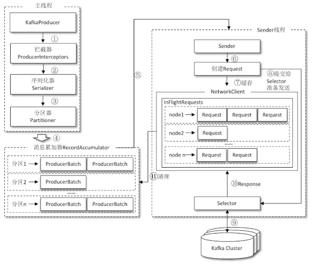

> 在学习`Kafka`的过程中，计划逐步解决这些问题。

- Kafka的用途有哪些？使用场景如何？

  > - **消息系统：** Kafka 和传统的消息系统（也称作消息中间件）都具备系统解耦、冗余存储、流量削峰、缓冲、异步通信、扩展性、可恢复性等功能。与此同时，Kafka 还提供了大多数消息系统难以实现的消息顺序性保障及回溯消费的功能。
  > - **存储系统：** Kafka 把消息持久化到磁盘，相比于其他基于内存存储的系统而言，有效地降低了数据丢失的风险。也正是得益于 Kafka 的消息持久化功能和多副本机制，我们可以把 Kafka 作为长期的数据存储系统来使用，只需要把对应的数据保留策略设置为“永久”或启用主题的日志压缩功能即可。
  > - **流式处理平台：** Kafka 不仅为每个流行的流式处理框架提供了可靠的数据来源，还提供了一个完整的流式处理类库，比如窗口、连接、变换和聚合等各类操作。

- Kafka中的ISR、AR又代表什么？ISR的伸缩又指什么？

  > 

- Kafka中的HW、LEO、LSO、LW等分别代表什么？

  > 

- Kafka中是怎么体现消息顺序性的？

- Kafka中的分区器、序列化器、拦截器是否了解？它们之间的处理顺序是什么？

  > 顺序：拦截器 -> 序列化器 -> 分区器

- Kafka生产者客户端的整体结构是什么样子的？

  > 

- Kafka生产者客户端中使用了几个线程来处理？分别是什么？

  > 两个线程：
  >
  > - 主线程。
  > - Send 线程。

- Kafka的旧版Scala的消费者客户端的设计有什么缺陷？

- “消费组中的消费者个数如果超过topic的分区，那么就会有消费者消费不到数据”这句话是否正确？如果不正确，那么有没有什么hack的手段？

- 消费者提交消费位移时提交的是当前消费到的最新消息的offset还是offset+1?

- 有哪些情形会造成重复消费？

- 那些情景下会造成消息漏消费？

- KafkaConsumer是非线程安全的，那么怎么样实现多线程消费？

- 简述消费者与消费组之间的关系

- 当你使用kafka-topics.sh创建（删除）了一个topic之后，Kafka背后会执行什么逻辑？

- topic的分区数可不可以增加？如果可以怎么增加？如果不可以，那又是为什么？

- topic的分区数可不可以减少？如果可以怎么减少？如果不可以，那又是为什么？

- 创建topic时如何选择合适的分区数？

- Kafka目前有那些内部topic，它们都有什么特征？各自的作用又是什么？

- 优先副本是什么？它有什么特殊的作用？

- Kafka有哪几处地方有分区分配的概念？简述大致的过程及原理

- 简述Kafka的日志目录结构

- Kafka中有那些索引文件？

- 如果我指定了一个offset，Kafka怎么查找到对应的消息？

- 如果我指定了一个timestamp，Kafka怎么查找到对应的消息？

- 聊一聊你对Kafka的Log Retention的理解

- 聊一聊你对Kafka的Log Compaction的理解

- 聊一聊你对Kafka底层存储的理解（页缓存、内核层、块层、设备层）

- 聊一聊Kafka的延时操作的原理

- 聊一聊Kafka控制器的作用

- 消费再均衡的原理是什么？（提示：消费者协调器和消费组协调器）

- Kafka中的幂等是怎么实现的

- Kafka中的事务是怎么实现的（这题我去面试6家被问4次，照着答案念也要念十几分钟，面试官简直凑不要脸。实在记不住的话...只要简历上不写精通Kafka一般不会问到，我简历上写的是“熟悉Kafka，了解RabbitMQ....”）

- Kafka中有那些地方需要选举？这些地方的选举策略又有哪些？

- 失效副本是指什么？有那些应对措施？

- 多副本下，各个副本中的HW和LEO的演变过程

- 为什么Kafka不支持读写分离？

- Kafka在可靠性方面做了哪些改进？（HW, LeaderEpoch）

- Kafka中怎么实现死信队列和重试队列？

- Kafka中的延迟队列怎么实现（这题被问的比事务那题还要多！！！听说你会Kafka，那你说说延迟队列怎么实现？）

- Kafka中怎么做消息审计？

- Kafka中怎么做消息轨迹？

- Kafka中有那些配置参数比较有意思？聊一聊你的看法

- Kafka中有那些命名比较有意思？聊一聊你的看法

- Kafka有哪些指标需要着重关注？

- 怎么计算Lag？(注意read_uncommitted和read_committed状态下的不同)

- Kafka的那些设计让它有如此高的性能？

- Kafka有什么优缺点？

- 还用过什么同质类的其它产品，与Kafka相比有什么优缺点？

- 为什么选择Kafka?

- 在使用Kafka的过程中遇到过什么困难？怎么解决的？

- 怎么样才能确保Kafka极大程度上的可靠性？

- 聊一聊你对Kafka生态的理解