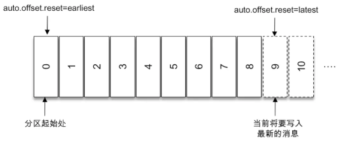

## 生产者

### KafkaProducer

【全类名】：`org.apache.kafka.clients.producer.KafkaProducer`

【描述】：生产者实例。

### ProducerRecord

【全类名】：`org.apache.kafka.clients.producer.ProducerRecord`

【描述】：消息对象。

【字段】：

```java
public class ProducerRecord<K, V> {
    private final String topic; //主题
    private final Integer partition; //分区号
    private final Headers headers; //消息头部
    private final K key; //键
    private final V value; //值
    private final Long timestamp; //消息的时间戳
}
```

- `topic`：消息要发往的主题。**必填。**

- `partition`：消息要发往的分区号。

- `headers`：消息的头部。用来设定一些与应用相关的信息。

- `key`：消息的键。

  - 消息的附件信息。

  - 可以用来计算分区号，让消息发往指定的分区。

  - 有 key 的消息支持日志压缩。

    > 详见书 5.4 节。

  > 同一个key的消息会被划分到同一个分区。

- `value`：消息体。一般不为空。**必填。**

  > 为空的消息体称为墓碑消息，详见书5.4节。

- `timestamp`：消息的时间戳。

  - `CreateTime`类型：表示消息创建的时间。
  - `LogAppendTime`类型：消息追加到日志文件的时间，详见书5.2节。


### Serializer

【全类名】：`org.apache.kafka.common.serialization.Serializer`

【描述】：序列化器实现类的父接口。

### Partitioner

【全类名】：`org.apache.kafka.clients.producer.Partitioner`

【描述】：分区器实现类的父接口。

### ProducerInterceptor

【全类名】：`org.apache.kafka.clients.producer.ProducerInterceptor`

【描述】：生产者拦截器实现类的父接口。

### ProducerInterceptors

【全类名】：`org.apache.kafka.clients.producer.internals.ProducerInterceptors`

【描述】：拦截器链，在`KafkaProducer`中，拦截器是封装成了拦截器链对象`ProducerInterceptors`。方法也是通过拦截器链对象去调用。

## 消费者

### KafkaConsumer

【全类名】：`org.apache.kafka.clients.consumer.KafkaConsumer`

【描述】：消费者实例。

【常用方法】：

```java
Set<TopicPartition> assignment();
```

> 用来获取消费者所分配到的分区信息。

```java
// 默认超时时间为客户端参数request.timeout.ms来设置
Map<TopicPartition, Long> beginningOffsets(Collection<TopicPartition> partitions);
Map<TopicPartition, Long> beginningOffsets(Collection<TopicPartition> partitions, Duration timeout);
```

> 获取指定分区的开头的消息位置。
>
> 一个分区的起始位置起初是0，单并不代表每时每刻都为0，因为日志清理的动作会清理旧的数据，所以分区的起始位置会自然而然的增加。日志清理见书5.4节。

```java
// 默认超时时间为客户端参数request.timeout.ms来设置
Map<TopicPartition, Long> endOffsets(Collection<TopicPartition> partitions);
Map<TopicPartition, Long> endOffsets(Collection<TopicPartition> partitions, Duration timeout);
```

> 获取指定分区的末尾的消息位置，即将要写入最新消息的位置。即下图中的9，不是8.
>
> 

```java
void seek(TopicPartition partition, long offset);
```

> 指定位移消费。

```java
void seekToBeginning(Collection<TopicPartition> partitions);
```

> 从分区的开头消费。
>
> 是`beginningOffsets()`和`seek()`的简化方式。

```java
void seekToEnd(Collection<TopicPartition> partitions);
```

> 从分区的末尾消费。
>
> 是`endOffsets()`和`seek()`的简化方式。

```java
Map<TopicPartition, OffsetAndTimestamp> offsetsForTimes(Map<TopicPartition, Long> timestampsToSearch);
Map<TopicPartition, OffsetAndTimestamp> offsetsForTimes(Map<TopicPartition, Long> timestampsToSearch, Duration timeout);
```

> 参数`timestampsToSearch`的key为待查询的分区，value为待查询的时间戳。
>
> <u>返回时间戳大于等于待查询时间戳的第一条消息对应的位置和时间戳。</u>

### Deserializer

【全类名】：`org.apache.kafka.common.serialization.Deserializer`

【描述】：反序列化器实现类的父接口。

### ConsumerRecord

【全类名】：`org.apache.kafka.clients.consumer.ConsumerRecord`

【描述】：消费者的消息对象。

```java
public class ConsumerRecord<K, V> {
  	// 消息所属的主题
    private final String topic;
  	// 消息所在分区的编号
    private final int partition;
  	// 消息在所属分区的偏移量
    private final long offset;
  	// 时间戳
    private final long timestamp;
  	// 时间戳的类型
    private final TimestampType timestampType;
  	// 键经过序列化后的大小，如果key为空，值为-1
    private final int serializedKeySize;
  	// 消息经过序列化后的大小，如果value为空，值为-1
    private final int serializedValueSize;
  	// 头部信息
    private final Headers headers;
  	// 键的值
    private final K key;
  	// 消息的值
    private final V value;
		// CRC32的校验值
    private volatile Long checksum;
}
```

### ConsumerRecords

【全类名】：`org.apache.kafka.clients.consumer.ConsumerRecords`

【描述】：表示一次拉取操作所获得的消息集，内部包含了若干`ConsumerRecord`。

【常用方法】：

```java
public List<ConsumerRecord<K, V>> records(TopicPartition partition);
```

> 获取消息集中指定分区的消息。

```java
public Iterable<ConsumerRecord<K, V>> records(String topic);
```

> 获取消息集中指定主题的消息。

```java
public Set<TopicPartition> partitions();
```

> 获取消息集中的所有分区。

```java
public int count();
```

> 计算出消息集中的消息个数。

```java
public boolean isEmpty();
```

> 用来判断消息集是否为空。

```java
public static <K, V> ConsumerRecords<K, V> empty();
```

> 用来获取一个空的消息集。

```java
long position(TopicPartition partition);
```

> 获取指定分区下一次需要拉取的消费位置。

```java
OffsetAndMetadata committed(TopicPartition partition);
```

> 获取指定分区已经提交过的消费位移。


## 通用

### TopicPartition

【全类名】：`org.apache.kafka.common.TopicPartition`

【描述】：表示分区，内容包括<u>分区所属的主题</u>和<u>自身的分区编号</u>。

```java
public final class TopicPartition implements Serializable {

    private final int partition; // 自身的分区编号
    private final String topic; // 分区所属的主题
}
```

> 这个类可以和我们通常所说的主题-分区的概念映射起来。

### PartitionInfo

【全类名】：`org.apache.kafka.common.PartitionInfo`

【描述】：主题的分区元数据信息。

【字段】：

```java
public class PartitionInfo {
  	// 主题名称
    private final String topic;
  	// 分区编号
    private final int partition;
  	// 分区的leader副本所在的位置
    private final Node leader;
  	// 分区的AR集合
    private final Node[] replicas;
  	// 分区的ISR集合
    private final Node[] inSyncReplicas;
  	// 分区的OSR集合
    private final Node[] offlineReplicas;
}
```

